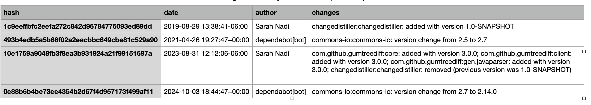

# In-Class Exercise: Dependency Management

## Technical Requirements

Before starting this exercise, ensure you have the following:

### Software

- **Python 3.11+** - [Download Python](https://www.python.org/downloads/) (required for Part 3)
- **GitHub Account** - [Sign up for GitHub](https://github.com/signup)

### Skills

- Basic Python programming (functions, file I/O, data structures) - required for Part 3
- Basic understanding of GitHub repositories and navigation

### Setup Verification

Run these commands to verify your setup:

```bash
python --version    # Should show Python 3.11 or higher (required for Part 3)
```

---

## Overview

**Dependencies** are external libraries, packages, or modules that software projects rely on to function, and **dependency management** is the process of declaring, versioning, and resolving these external libraries. This hands-on exercise is designed to help you understand how to analyze dependency information both manually and programmatically. You will work with Java repositories, explore their dependency structures, and create an automated Python script to mine for commits that change dependency versions.

**This exercise will focus on investigating dependency management and files.** You will learn to:

1. Analyze repositories for dependency management setup and files
2. Create a Python script to automatically mine commits that change dependency version in dependency files

---

## GenAI Usage Policy

The use of Generative AI tools (e.g., ChatGPT, Cursor, GitHub Copilot, Claude) is permitted for this exercise with the following guidelines:

### Allowed Uses

- Understanding dependency file formats (pom.xml, requirements.txt, pyproject.toml, build.gradle)
- Learning how to use [PyDriller](https://pydriller.readthedocs.io/en/latest/) for mining Git repositories
- Debugging error messages in your script
- Clarifying concepts about dependency management and version specifications
- Researching parsing libraries and tools (XML parsers, PyDriller API, etc.)

### Not Allowed

- Generating the complete dependency mining script
- Using AI to write your manual dependency analysis (Part 1)
- Having AI write your investigation findings for Part 2
- Using AI to generate the entire solution without learning the concepts

## Repositories for Investigation (a.k.a. Target Repository)

For this exercise, you will investigate the dependencies in a simple toy Java repository: [https://github.com/snadi-teaching/dependency-demo](https://github.com/snadi-teaching/dependency-demo)

---

## Exercise Instructions

**Total Time: 75 minutes**

### Set Up Your Repository (5 minutes)

**Create your own repository from this template:**

1. Click **"Use this template"** button (green button at the top of the repo)
2. Select **"Create a new repository"**
3. Name it appropriately (e.g., `SAhandons-topic2-yourname`)

**Clone your repository:**

```bash
git clone <your-repo-url>
cd <repo-name>
```

> **Note:** Do NOT fork or clone this template directly. Always use the "Use this template" button to create your own copy.

## Part 1: Understanding Dependency Files in Java

### Task 1.1: Extract Dependencies Manually

Go to the github url of the target repository and find the following (assuming the latest state of the code on the main branch):

1. **Locate the dependency file(s)** in the repository.
2. **Determine where dependencies are declared in the depedency file** and how to identify their version numbers (i.e., understand the format of the dependency file). 
3. **Create a summary** with the following information:
   - Dependency file name and the short note explaining how dependencies and their versions are declared in the dependency file
   - Total number of dependencies declared in the dependency file
   - Example of 2 selected dependencies with their declared versions

---

## Part 2: Automatically Mine Dependency Changes from Commit History (40 minutes)

### Task 2.1: Research and Write Your Script
 
**Goal:** Mine the commit history of a Java repository to identify commits that changed the project's depedencies using **PyDriller**.

**[PyDriller](https://pydriller.readthedocs.io/en/latest/)** is a Python framework that helps developers analyze Git repositories. It simplifies accessing commit history, file modifications, and code changes.

**Before writing code, you should:**

- Research how to use PyDriller to traverse commit history, filtering for modifications to specific file extensions
- Learn how to access modified files in each commit using PyDriller
- Understand how to get file content before and after changes
- Think of how you will identify if a commit (1) added a new dependency, (2) deleted a dependency, or (3) changed the version of a dependency

A starter code file `dependency-miner.py` is provided in the `scripts/` directory. You need to complete the implementation such that the script:

1. **Takes a repository input** (owner and repository name as separate arguments)
2. **Uses PyDriller** to analyze the commit history and find commits that modified pom.xml files
3. **Identifies commits with changes to the declared dependencies** (i.e., a commit that either adds/removes a dependency or changes the version number of a dependency)
4. **Outputs the results** showing:
   - Total number of commits that changed the dependencies
   - A csv file that lists all commits with dependency changes with the following info:
     - Commit hash
     - Commit date
     - Commit author
     - Name of changed dependency
     - Type of dependency change ("added", "removed", "changed from <old version> to <new version>")

Note: if a commit changes multiple dependencies, you have the choice to have a row per change or have one row per commit and aggregate the changes in the type of dependency change column

**Example Output Format:**

Console output: The following output is based on analyzing a repo that is different from your target repo. The output is provided for illustration purposes

```
Analyzing repository: snadi-teaching/CodeAnalysisDemos
URL: https://github.com/snadi-teaching/CodeAnalysisDemos
This may take a few minutes...

Results:
Number of commits with dependency changes: 4
Commit list saved to: snadi-teaching_CodeAnalysisDemos_dependency_commits.csv
```

The following shows the contents of the csv file:



### Task 2.2: Test Your Script

1. **Test with the snadi-teaching/dependency-demo repository**:
   ```bash
   # Run the script with owner and repo as arguments
   python dependency-miner.py snadi-teaching dependency-demo
   ```
2. The script will output summary statistics and save the commit list to a file
3. Open the generated file to view and verify the commits

### Optional Challenge: Test with Larger Repository

Once your script works with the demo repository, try it with a larger real-world repository:

```bash
python dependency-miner.py pac4j dropwizard-pac4j
```

This repository has many more commits and dependency changes. Additionally, there are certain characteristics of its pom.xml file that will likely make your script fail. Can you already identify potential issues and the assumptions your script makes?

---

## Submission Instructions

Submit the following to **Brightspace**:

### Required Submissions

\*_Total Points: out of 15 points_

1. **Part 1: (3 points)**
   - Analysis of dependency file as required (dependency file name, short note, total dependencies, 2 examples)

2. **Part 2: (12 points)**
   - Your completed and tested **`dependency-miner.py`** script
   - The generated output file showing commits with dependency changes from `snadi-teaching/dependency-demo` repository
   - Screenshot or copy of console output
   - **`requirements.txt`** file
   - GenAI conversation documentation (if used)
   - (Optional) Output and notes from the larger `pac4j/dropwizard-pac4j` repository if you completed the challenge

---

## Resources and References

- **Maven POM Reference**: [Maven Documentation](https://maven.apache.org/pom.html)
- **PyDriller Library**: [PyDriller Documentation](https://pydriller.readthedocs.io/) - Python framework for mining Git repositories
- **PyDriller Examples**: [GitHub Examples](https://github.com/ishepard/pydriller/tree/master/docs/examples)
- Remember that a demo of using PyDriller was giving in the Mining Software Repositories lecture. 

---

## Acknowledgement

This exercise was developed with the assistance of [Cursor](https://cursor.com/), an AI-powered code editor. Cursor was used to:

- Generate starter code for 'dependency-miner.py' and the 'requirements.txt' file and iteratively refine them
- Draft and refine this README documentation iteratively

---

## License

MIT License - See [LICENSE](LICENSE) file for details.
